# CodeZero Architecture



```
                                    INTERNET
    ┌─────────────────────────────────────────────────────────────────┐
    │                                                                 │
    │   iPhone / Browser                    External Agent            │
    │   (React 19 SPA)                      (Claude Code, etc.)      │
    │        │                                     │                  │
    │        │ HTTPS                               │ MCP Streamable   │
    │        │ codez.yourdomain.com                │ HTTP (POST/GET)  │
    │        │                                     │                  │
    └────────┼─────────────────────────────────────┼──────────────────┘
             │                                     │
             ▼                                     ▼
    ┌──────────────────────────────────────────────────────────────┐
    │                   Cloudflare Edge                            │
    │                                                              │
    │   TLS termination          Tunnel: codez.yourdomain.com     │
    │   (Secure cookie works     ──────────────────────►          │
    │    because CF provides                                       │
    │    HTTPS to the browser)   authkit.yourdomain.com           │
    │                            (MCPAuthKit Worker + D1)          │
    │                            ┌───────────────────────┐         │
    │                            │ OAuth 2.1 + PKCE      │         │
    │                            │ /oauth/authorize       │         │
    │                            │ /oauth/token           │         │
    │                            │ /oauth/userinfo        │         │
    │                            │ /prm/:server_id        │         │
    │                            └───────────────────────┘         │
    └──────────────────────┬───────────────────────────────────────┘
                           │
                           │ HTTP (tunnel origin)
                           │ localhost:4097
                           ▼
    ┌──────────────────────────────────────────────────────────────┐
    │                                                              │
    │   Bun HTTP Server  (server/index.ts)         Mac Mini / MBP │
    │   127.0.0.1:4097                                             │
    │                                                              │
    │   ┌──────────────────────────────────────────────────────┐   │
    │   │                    Auth Layer                         │   │
    │   │                                                      │   │
    │   │  /api/*    → Cookie JWT (CookieAuthProvider)         │   │
    │   │              or Cloudflare Access (Cf-Access-Jwt)     │   │
    │   │              Loopback bypass for 127.0.0.1            │   │
    │   │                                                      │   │
    │   │  /mcp      → AuthKit OAuth tokens (mat_*)            │   │
    │   │              Validated via authkit.yourdomain.com     │   │
    │   │              /oauth/userinfo + 5-min cache            │   │
    │   │              Loopback bypass for 127.0.0.1            │   │
    │   └──────────────────────────────────────────────────────┘   │
    │                                                              │
    │   ROUTES                                                     │
    │   ──────                                                     │
    │   /                         Static SPA (web/dist)            │
    │   /api/auth/*               Login, logout, me                │
    │   /api/health               Health + self-heal details       │
    │   /api/projects             List projects, sessions, memory  │
    │   /api/sessions/:id/*       Get, prompt, abort, dispose,     │
    │                             fork, upload, permission         │
    │   /api/events               SSE multiplexer (all sessions)   │
    │   /api/state                Markers, preferences             │
    │   /api/search               Full-text across sessions        │
    │   /api/observability        Cost + usage stats               │
    │   /mcp                      MCP Streamable HTTP transport    │
    │   /.well-known/oauth-*      Protected Resource Metadata      │
    │                                                              │
    │   ┌────────────────────────────────────────────────────┐     │
    │   │                  MCP Transport                      │     │
    │   │                  /mcp (POST/GET/DELETE)              │     │
    │   │                                                     │     │
    │   │  WebStandardStreamableHTTPServerTransport           │     │
    │   │  ┌───────────────────────────────────────────┐      │     │
    │   │  │ 17 Tools (via CodeZeroClient → /api/*)    │      │     │
    │   │  │                                           │      │     │
    │   │  │ list_projects    get_session              │      │     │
    │   │  │ list_sessions    create_session            │      │     │
    │   │  │ send_prompt      abort_session             │      │     │
    │   │  │ dispose_session  fork_session              │      │     │
    │   │  │ respond_permission                        │      │     │
    │   │  │ get_project_memory  search_sessions       │      │     │
    │   │  │ poll_events (SSE buffer)                  │      │     │
    │   │  │ get_health  get_health_details            │      │     │
    │   │  │ get_state   update_state                  │      │     │
    │   │  │ get_observability                         │      │     │
    │   │  └───────────────────────────────────────────┘      │     │
    │   │                    │                                │     │
    │   │                    │ loopback HTTP                   │     │
    │   │                    │ (auth bypassed)                 │     │
    │   │                    ▼                                │     │
    │   │              /api/* endpoints                       │     │
    │   └────────────────────────────────────────────────────┘     │
    │                                                              │
    │   ┌──────────────────────────────────────────────────────┐   │
    │   │                  Core Engine                          │   │
    │   │                                                      │   │
    │   │  EventBus ◄──────────────────────────────────────┐   │   │
    │   │     │  (in-process pub/sub, fans to SSE clients) │   │   │
    │   │     │                                            │   │   │
    │   │     ▼                                            │   │   │
    │   │  SessionPool                                     │   │   │
    │   │     │                                            │   │   │
    │   │     ├── SessionProcess (live)                    │   │   │
    │   │     │     │                                      │   │   │
    │   │     │     │  spawns claude CLI                   │   │   │
    │   │     │     │  --input-format stream-json           │   │   │
    │   │     │     │  --output-format stream-json          │   │   │
    │   │     │     │  --verbose --include-partial-messages │   │   │
    │   │     │     │                                      │   │   │
    │   │     │     │  stdin: user prompts ──────►          │   │   │
    │   │     │     │  stdout: stream events ◄────── ──────┘   │   │
    │   │     │     │                                          │   │
    │   │     │     └── Auth fallback: OAuth-first,            │   │
    │   │     │         retry with API key on billing error    │   │
    │   │     │                                                │   │
    │   │     ├── SessionTailer (mirror/idle)                  │   │
    │   │     │     fs.watch on ~/.claude/projects/<slug>/<id>.jsonl
    │   │     │     Emits message.created into EventBus        │   │
    │   │     │                                                │   │
    │   │     └── ChannelBridgePool                            │   │
    │   │           Subscribes to opzero-channel plugin SSE    │   │
    │   │           Relays channel events into EventBus        │   │
    │   │                                                      │   │
    │   │  SelfHeal                                            │   │
    │   │     Periodic reconciliation: stale channels,         │   │
    │   │     orphan processes, bridge health, auth health     │   │
    │   └──────────────────────────────────────────────────────┘   │
    │                                                              │
    │   ┌──────────────────────────────────────────────────────┐   │
    │   │           Terminal Claude Sessions                    │   │
    │   │                                                      │   │
    │   │  ./scripts/launch-opzero.sh                          │   │
    │   │     │                                                │   │
    │   │     └── claude --session-id <uuid>                   │   │
    │   │            │                                         │   │
    │   │            └── MCP stdio plugin: opzero-channel      │   │
    │   │                  │                                   │   │
    │   │                  ├── POST /inject  (web → terminal)  │   │
    │   │                  ├── GET  /events  (terminal → web)  │   │
    │   │                  ├── POST /permission (verdict relay) │   │
    │   │                  │                                   │   │
    │   │                  └── Discovery file:                 │   │
    │   │                     ~/.opzero-claude/channels/<id>.json
    │   │                     { port, secret, pid }            │   │
    │   └──────────────────────────────────────────────────────┘   │
    │                                                              │
    │   PERSISTENCE                                                │
    │   ───────────                                                │
    │   ~/.claude/projects/<slug>/<id>.jsonl   Session history     │
    │   ~/.config/opzero-claude/config.json    Server config       │
    │   ~/.config/opzero-claude/state.json     Markers, prefs      │
    │   ~/.opzero-claude/channels/<id>.json    Channel discovery   │
    │                                                              │
    └──────────────────────────────────────────────────────────────┘


    DATA FLOW: User sends prompt from phone
    ─────────────────────────────────────────

    iPhone Safari
         │
         │  POST /api/sessions/:id/prompt  {text: "Fix the tests"}
         ▼
    Bun server (cookie auth)
         │
         ├── Channel exists? ──yes──► POST /inject to opzero-channel plugin
         │                                  │
         │                                  ▼
         │                            claude CLI receives <channel> tag
         │                            responds via reply tool
         │                            opzero-channel broadcasts SSE
         │                                  │
         │                                  ▼
         │                            ChannelBridgePool picks up SSE
         │                            emits into EventBus
         │
         └── No channel? ──────────► pool.resumeOrCreate(id, cwd)
                                          │
                                          ▼
                                    SessionProcess.sendUserPrompt()
                                    writes to claude stdin
                                    stdout parser emits stream events
                                    into EventBus
                                          │
                                          ▼
                                    EventBus.emit(message.created)
                                    EventBus.emit(message.part.delta)
                                          │
                                          ▼
                                    /api/events SSE stream
                                          │
                                          ▼
                                    React SPA dispatches to store
                                    MessageThread re-renders


    DATA FLOW: Agent creates session via MCP
    ─────────────────────────────────────────

    External Agent (Claude Code)
         │
         │  POST /mcp  (MCP initialize + tools/call)
         │  Authorization: Bearer mat_xxx
         ▼
    Bun server (/mcp route)
         │
         │  validateToken(mat_xxx) → authkit.yourdomain.com/oauth/userinfo
         │  ✓ authenticated
         │
         ▼
    WebStandardStreamableHTTPServerTransport
         │
         │  dispatch("create_session", {slug, cwd})
         ▼
    CodeZeroClient.createSession()
         │
         │  POST http://127.0.0.1:4097/api/projects/:slug/sessions
         │  (loopback — auth bypassed)
         ▼
    sessionsRoutes → pool.createNew(cwd)
         │
         ▼
    SessionProcess spawned
    Agent can now send_prompt, poll_events, abort, dispose
```
